# Practical AWS IoT Core

## Pre requisites

Install [**Terraform**](https://www.terraform.io/downloads)

Have an AWS User with the following policies:
a
* IAMFullAccess
* AmazonS3FullAccess
* AmazonDynamoDBFullAccess
* CloudWatchLogsFullAccess
* AWSIoTFullAccess
* CloudWatchEventsFullAccess
* AmazonTimestreamFullAccess
* AWSLambda_FullAccess

Then we'll need to retrieve the AWS Root certificate:

```shell
curl https://www.amazontrust.com/repository/AmazonRootCA1.pem > files/root-CA.crt
```

Then we have to install the python dependencies with:

```shell
pip install -r src/requirements.txt
```

We also have to initialize terraform with the command (execute it in the *terraform* directory :

```shell
terraform init
```

## Context

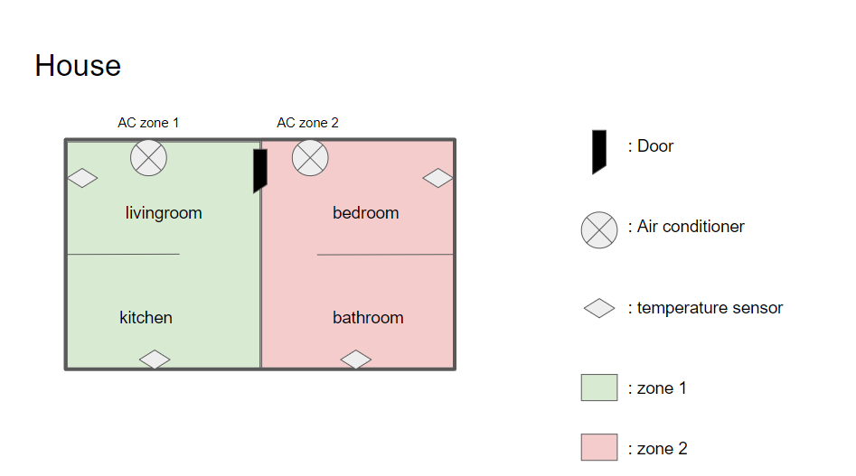

During this practical we are going to simulate a house divided in 2 zones (1 and 2) of 2 rooms + 1 air conditioner each
with a temperature sensor in each room

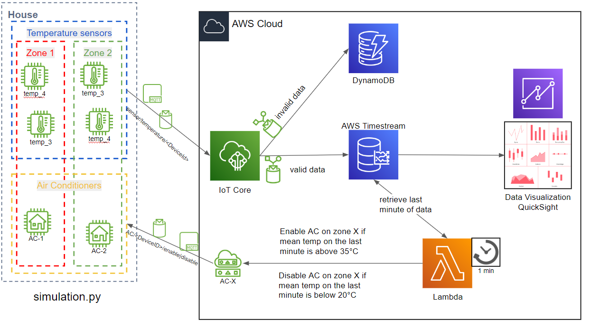
The architecture schema above represents the global system, when finished, the sensors will send temperature data (every
5 seconds) to AWS IoT Core, the valid data will be sent to a Timestream database and the invalid data (with a
temperature > 40 °C which is caused by captors artefacts) will be sent to a DynamoDB.

Every minute an AWS Lambda function will retrieve the temperature data from the last minute from the Timestream DB,
calculate the mean temperature for each Zone and then send a message to a mqtt topic that the Air Conditioner subscribed
to, to enable the AC if the mean temperature of the zone is above 35 °C and disable it if the temperature is below 20 °C

We will also be able to plug a data visualization brick to monitor the temperature in the different zones and rooms

## Tasks

During the practical, I recommend applying your terraform changes after every task to debug your errors, step by step

### Part 1: Iot Core setup

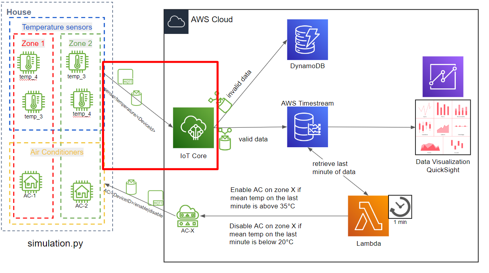

#### First we will have to setup AWS IoT Core:

We'll need to declare some *AWS Iot Core resources* in the *iot.tf* file :

[**aws_iot_certificate**](https://registry.terraform.io/providers/hashicorp/aws/latest/docs/resources/iot_certificate)
with the *active* option

[**aws_iot_policy**](https://registry.terraform.io/providers/hashicorp/aws/latest/docs/resources/iot_policy) with the
policy located in the *terraform/files/iot_policy.json* file using the terraform's [**file module**](https://www.terraform.io/language/functions/file)

[**aws_iot_policy_attachment**](https://registry.terraform.io/providers/hashicorp/aws/latest/docs/resources/iot_policy_attachment)
to attach the policy declared before to our certificate

[**aws_iot_thing**](https://registry.terraform.io/providers/hashicorp/aws/latest/docs/resources/iot_thing) which is our
connected object

[**aws_iot_thing_principal_attachment**](https://registry.terraform.io/providers/hashicorp/aws/latest/docs/resources/iot_thing_principal_attachment)
to attach our policy to our *iot_thing*

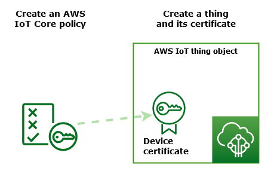

I declared some *resources* and *outputs* in the output.tf file so make sure the names match the one you use in your
resources

#### Then we have to declare a *data source*:

[**aws_iot_endpoint**](https://registry.terraform.io/providers/hashicorp/aws/latest/docs/data-sources/iot_endpoint) with
an endpoint type "iot:Data-ATS"


After you applied your changes, you can go to the *src/simulation.py* and change the **ENDPOINT** (line 10) 
by the value "iot_endpoint" logged at the end of your "terraform apply"


### Part 2: DynamoDB + Iot Topic rule (Invalid Data)

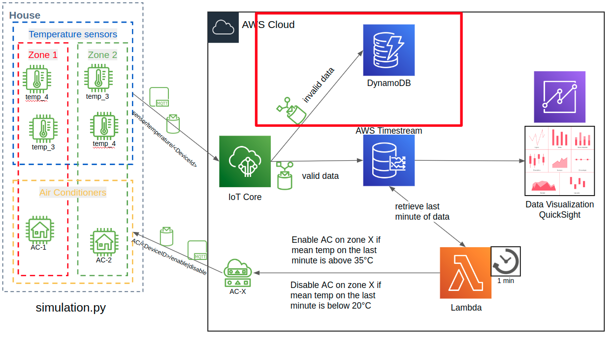

In this part we are going to create a DynamoDB to store *invalid data* and an IoT Topic Rule to forward mqtt messages to
the DB

We'll need to declare some *AWS Iot Core resources*  :

in the *dynamo.tf* file, an [**aws_dynamodb_table**](https://registry.terraform.io/providers/hashicorp/aws/latest/docs/resources/dynamodb_table)
named "Temperature" with a *hash_key* named "id" an attribute named "id" of type string ("S")

in the *iot.tf* file, an [**aws_iot_topic_rule**](https://registry.terraform.io/providers/hashicorp/aws/latest/docs/resources/iot_topic_rule) with
the sql query "SELECT *  FROM 'sensor/temperature/+' where temperature >= 40" and a **dynamodbv2** action to link to the temperature table and linked to the "iot_role" role

in the *iam.tf* file:
* an [**aws_iam_role**](https://registry.terraform.io/providers/hashicorp/aws/latest/docs/resources/iam_role) called **iot_role** with the following *assume_role_policy*:
```json
{
  "Version": "2012-10-17",
  "Statement": [
    {
      "Effect": "Allow",
      "Principal": {
        "Service": "iot.amazonaws.com"
      },
      "Action": "sts:AssumeRole"
    }
  ]
}
```

* an [**aws_iam_role_policy**](https://registry.terraform.io/providers/hashicorp/aws/latest/docs/resources/iam_role_policy) to
grant dynamoDB (**dynamodb:PutItem** action) access to the iam role "iot_role"

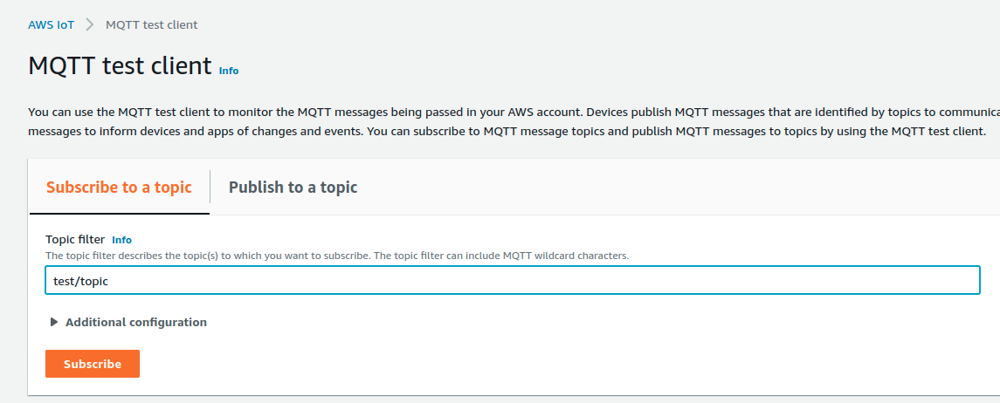

To test the Topic Rule we can use the MQTT test client in the AWS Console => "Publish to a topic"

you can send data to the topic : **sensor/temperature/temp_1** a message like this:

```json
{
  "id": "429fe896-b59b-4f87-8c68-164ba334f1fb",
  "temperature": 45,
  "sensor_id": 1,
  "zone_id": 1
}
```

and go to the DynamoDB tab to see if your data is in th DB like so:

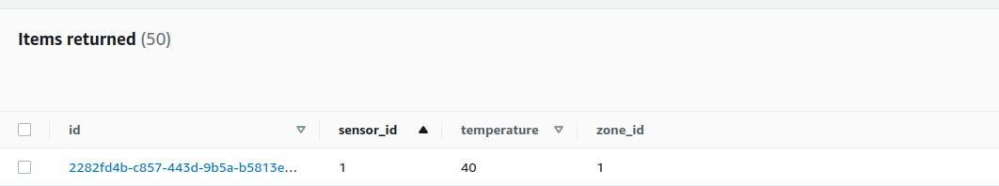


### Part 3: Timestream DB + Iot Topic rule (Valid Data)

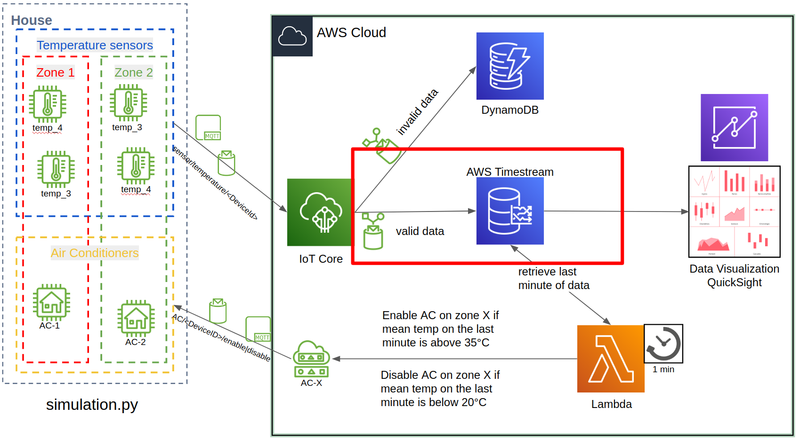


In this part we are going to create a Timestream Database to store *valid data* and an IoT Topic Rule to forward mqtt messages to
the DB

We'll need to declare some *AWS Iot Core resources*  :

in the *timestream.tf* file:
* a [**timestreamwrite_database**](https://registry.terraform.io/providers/hashicorp/aws/latest/docs/resources/timestreamwrite_database)
with a database_name "iot"

* a [**timestreamwrite_table**](https://registry.terraform.io/providers/hashicorp/aws/latest/docs/resources/timestreamwrite_table)
linked to the previously created database and a table_name "temperaturesensor" with the 


in the *iot.tf* file, an [**aws_iot_topic_rule**](https://registry.terraform.io/providers/hashicorp/aws/latest/docs/resources/iot_topic_rule) with
the sql query "SELECT * FROM 'sensor/temperature/+'" and a timestream action to link to the temperaturesensor table created bellow, with 3 "dimensions" and a timestamp:
```hcl
    dimension {
      name  = "sensor_id"
      value = "$${sensor_id}"
    }

    dimension {
      name  = "temperature"
      value = "$${temperature}"
    }

    dimension {
      name  = "zone_id"
      value = "$${zone_id}"
    }

    timestamp {
      unit  = "MILLISECONDS"
      value = "$${timestamp()}"
    }
```
and linked to the "iot_role" role

in the *iam.tf* file, an [**aws_iam_role_policy**](https://registry.terraform.io/providers/hashicorp/aws/latest/docs/resources/iam_role_policy) with 2 statements,
one to grant **timestream:WriteRecords** action to the *aws_timestreamwrite_table* resource we created earlier and a **timestream:DescribeEndpoints** action to the resource "*" (all resources).
We'll attach those policies to the iam role "iot_role"


To test the Topic Rule we can use the MQTT test client in the AWS Console => "Publish to a topic"


you can send data to the topic : **sensor/temperature/temp_1** a message like this:

```json
{
  "id": "f72e6a3a-7be2-4791-83a7-917ad9abf414",
  "temperature": 20,
  "sensor_id": 1,
  "zone_id": 1
}
```
then you can go to the Query Editor tab in the Timestream service :

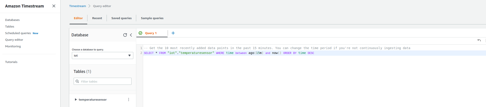

a query like this:

```sql
SELECT * FROM "iot"."temperaturesensor" WHERE time between ago(15m) and now() ORDER BY time DESC
```


### Part 4: Scheduled Lambda

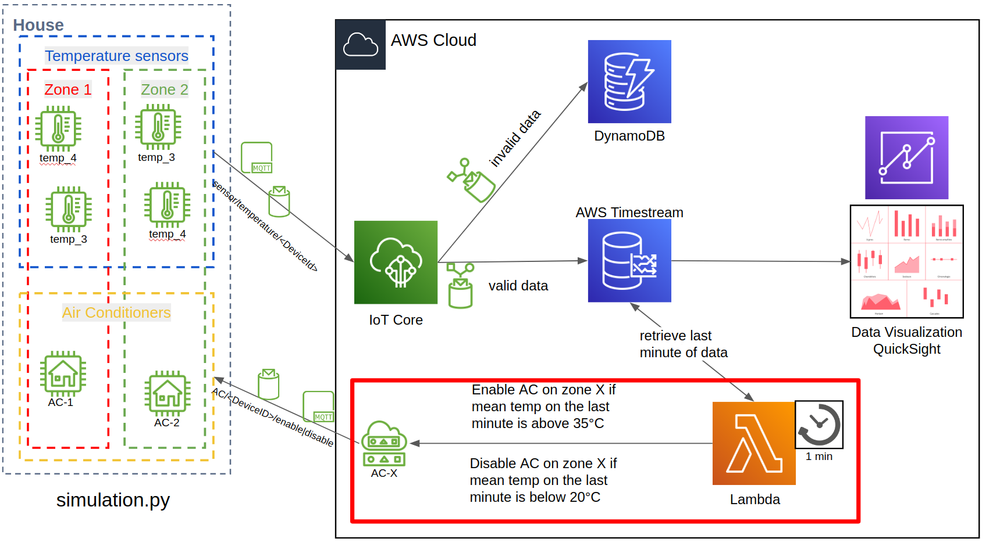

Now that our system can write in 2 databases valid and invalid data we would like to perform actions on this data,
we will trigger an AWS Lambda every minute to calculate the mean temperature by zone and activate/deactivate the AC depending on the result

The code for the lambda is in the *ac_control_lambda* directory and the scripts to package / deploy the lambda is in the *bin* directory, I will tell you when to use it

First we will need some IAM resources, in the *iam.tf* file create:

* an [**aws_iam_role**](https://registry.terraform.io/providers/hashicorp/aws/latest/docs/resources/iam_role) called **lambda_role** with the following *assume_role_policy*:
```json
{
  "Version": "2012-10-17",
  "Statement": [
    {
      "Action": "sts:AssumeRole",
      "Principal": {
        "Service": "lambda.amazonaws.com"
      },
      "Effect": "Allow",
      "Sid": ""
    }
  ]
}
```
* an [**aws_iam_role_policy**](https://registry.terraform.io/providers/hashicorp/aws/latest/docs/resources/iam_role_policy) with 2 statements,
one to grant **timestream:Select** action to the *aws_timestreamwrite_table* resource we created earlier and a **timestream:DescribeEndpoints** action to the resource "*" (all resources).
We'll attach those policies to the iam role "lambda_role"

* an [**aws_iam_role_policy**](https://registry.terraform.io/providers/hashicorp/aws/latest/docs/resources/iam_role_policy) with 1 statement,
one to grant **iot:Publish** action to "*" (all resources).
We'll attach those policies to the iam role "lambda_role"

Then, we'll need to create some resource in the *lambda.tf* file:

* a [**lambda_function**](https://registry.terraform.io/providers/hashicorp/aws/latest/docs/resources/lambda_function)
with the *filename* **"files/empty_package.zip"** which is an empty zip package, the *function_name* **"ac_control_lambda"**,
the *handler* **"ac_control_lambda.lambda_handler"** and the *runtime* **"python3.7"**

* an [**aws_cloudwatch_event_rule**](https://registry.terraform.io/providers/hashicorp/aws/latest/docs/resources/cloudwatch_event_rule)
with a *schedule_expression* **"rate(1 minute)"**

* an [**aws_cloudwatch_event_target**](https://registry.terraform.io/providers/hashicorp/aws/latest/docs/resources/cloudwatch_event_target)
with a rule that is the name of the *aws_cloudwatch_event_rule* we created before, the *target_id* **"lambda"** and the *arn* of the *aws_lambda_function* we created before

* an [**aws_lambda_permission**](https://registry.terraform.io/providers/hashicorp/aws/latest/docs/resources/lambda_permission)
with the following:
```hcl
  statement_id  = "AllowExecutionFromCloudWatch"
  action        = "lambda:InvokeFunction"
  function_name = aws_lambda_function.ac_control_lambda.function_name
  principal     = "events.amazonaws.com"
  source_arn    = aws_cloudwatch_event_rule.every_one_minute.arn
```
**Make sure to have the right function_name and source_arn according to how you named your resources**

Learn more with https://openupthecloud.com/terraform-lambda-scheduled-event/

Now that you have an up and running lambda you will need to deploy the code contained in the ac_control_lambda directory,
to do so you will need to run the two following commands:

````shell
./bin/package_lambda.sh
./bin/deploy_lambda.sh
````
To test this part you have to run the **simulation.py** on your computer and wait until the temperature is rising above 35 °C and then you should
see a message like this in the logs : "ZONE X : AC SWITCH TO True"

### Part 5: GitlabCI

Now we are going to set up the CI/CD to package and deploy our AWS Lambda

First we have to create an AWS Programmatic User with the **AWSLambda_FullAccess** policy, get the csv file or the
AWS_ACCESS_KEY_ID & AWS_SECRET_ACCESS_KEY and add them in the CI/CD Setting :


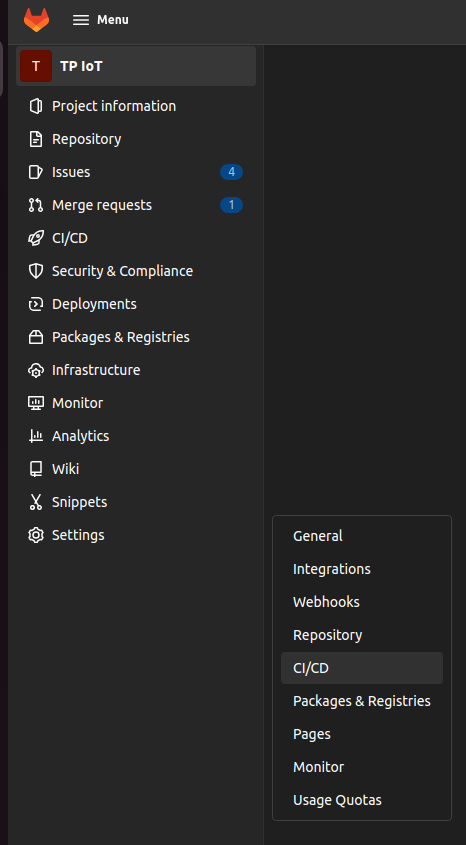
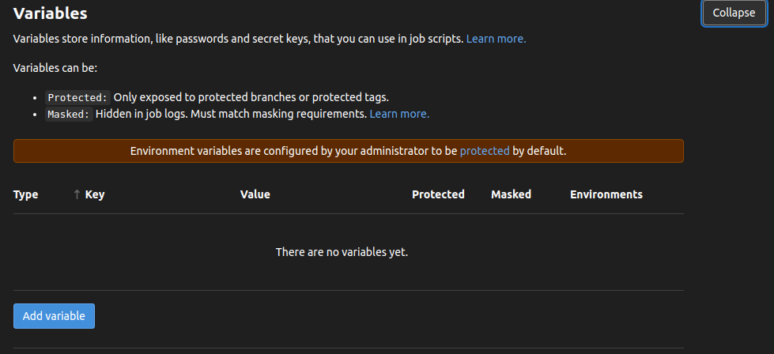

Now we can fill our **.gitlab-ci.yml** file, first we have to use the image: **"lambci/lambda:build-python3.7"**

then a step in the **before_script**:
```yaml
before_script:
  - pip install pytest
```
then create 3 stages, **test**, **package** and **deploy**

and we will have one job per stage,

For the **test** stage, create a pytest job that runs:
```yaml
script:
  - pytest ac_control_lambda/tests -vv
```


For the **package** stage, create a package job that runs:
```yaml
script:
  - ./bin/package_lambda.sh
```
the package stage will produce an artifact (the zip file) that needs to be passed to the other stages (deploy), to do so,
you can inspire from the following: [**gitlab documentation**](https://docs.gitlab.com/ee/ci/pipelines/job_artifacts.html#create-job-artifacts)


For the **deploy** stage, create a deploy job that runs:
```yaml
script:
  - ./bin/deploy_lambda.sh
```

then you can push your code to git and make sure that the step are working 

### Part 6: DataVisualisation with AWS QuickSight

This final Part is a Bonus Part, so I will not give much information, you will have to connect to the AWS Console and 
go to the QuickSight tab then use the following [**documentation**](https://docs.aws.amazon.com/timestream/latest/developerguide/Quicksight.html), you can take screenshot of your dashboards and add them 
to your GitLab repository to show me what you achieved

### Part 7: Destroy it all

Now that tou have finished the practical, you must remove all the resources you've created, terraform destroy will destroy most of them
but you also need to delete your quicksight account, make sure it is cleaned because quicksight is a pretty expensive service
